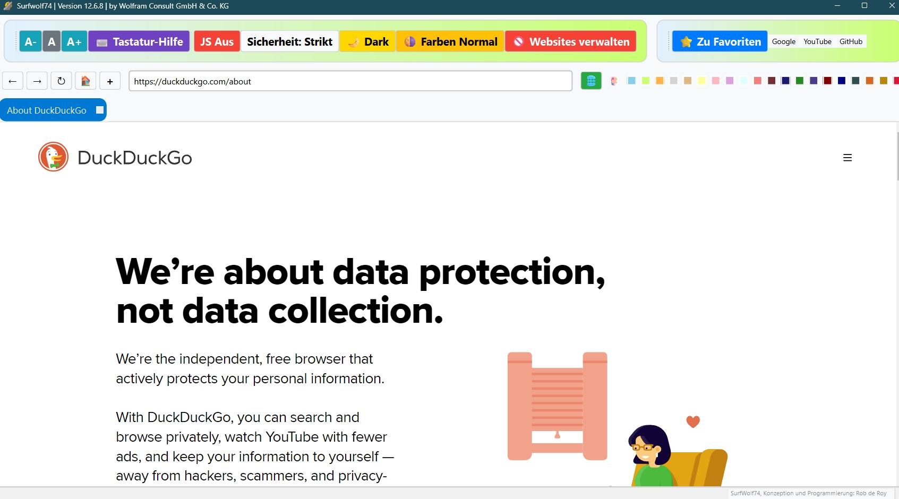

# SurfWolf74

Ein moderner, datensparsamer Webbrowser auf Basis von PyQt6 und Chromium
(QtWebEngine). Läuft unter **Windows und Linux** (Debian/Ubuntu).

## ⬇️ Download für Windows

**[▶ SurfWolf74-Setup.exe herunterladen](https://github.com/Wolfram33/surfwolf74/releases/download/latest-dev/SurfWolf74-Setup.exe)** — installieren und starten, **kein Python nötig**.

Alternativ ohne Installation: **[Portable-ZIP](https://github.com/Wolfram33/surfwolf74/releases/download/latest-dev/SurfWolf74-portable.zip)** (entpacken, `surfwolf74.exe` starten).

> Der Download wird bei jeder Änderung automatisch neu gebaut (GitHub Actions).
> Alle Versionen: **[Releases](https://github.com/Wolfram33/surfwolf74/releases)**.

> [!IMPORTANT]
> **Videowiedergabe unter Windows:** Aus Lizenzgründen spielt die Windows-Version
> **keine reinen H.264-Videos** ab – das betrifft vor allem **x.com / Twitter**.
> YouTube und die meisten anderen Seiten (VP9) laufen normal.
> Für H.264-Seiten den Button **„🌐 Extern" (Strg+E)** nutzen: Er öffnet die
> aktuelle Seite im System-Browser (Chrome/Edge), der H.264 kann.
> Die **Linux-Version** spielt H.264 (und damit x.com) dagegen **nativ** ab.



## Features

- Tab-basiertes Browsing
- Lesezeichen-Verwaltung (mit Drag & Drop)
- Website-Blocker
- Dark Mode und individuelle Farbthemen
- Website-Farben invertieren (Invert-Modus)
- JavaScript zur Laufzeit aktivieren/deaktivieren
- Normaler und strikter Sicherheitsmodus (Privacy-Header, Anti-Fingerprinting)
- Anpassbare Startseite
- Verschiebbare Toolbars (Position wird gemerkt)
- Aktuelle Seite im System-Browser öffnen (Strg+E)

## Voraussetzungen

- Python 3.10+
- PyQt6
- PyQt6-WebEngine

## Installation und Start

### Aus dem Quellcode (Windows & Linux)

```bash
pip install PyQt6 PyQt6-WebEngine
python surfwolf74.py
```

### Linux: natives Paket (Debian/Ubuntu)

Im Verzeichnis [`linux-kiosk/`](linux-kiosk/) liegt ein nativer `.deb`-Installer.
Er nutzt Debians **System-QtWebEngine** und installiert alle Abhängigkeiten
automatisch:

```bash
sh linux-kiosk/debian-package/build.sh                  # erzeugt surfwolf74_<version>_all.deb
sudo apt install ./linux-kiosk/surfwolf74_<version>_all.deb
```

Danach ist „SurfWolf74" im Anwendungsmenü und über den Befehl `surfwolf74`
verfügbar.

## Videowiedergabe / Codecs (wichtig)

QtWebEngine spielt MP4/H.264-Videos nur mit proprietären Codecs ab.

- **Windows / pip-Wheels:** ohne H.264 gebaut. Seiten, die ausschließlich
  H.264 streamen (z. B. x.com), spielen **nicht im Browser** – dafür gibt es
  den Button **„🌐 Extern" (Strg+E)**, der die Seite im System-Browser öffnet.
  YouTube u. a. (VP9) funktionieren normal.
- **Linux (Debian/Ubuntu, System-Paket):** `python3-pyqt6.qtwebengine` ist
  **mit** H.264/AAC gebaut – dort spielt auch x.com direkt im Browser.

## Speicherort der Nutzerdaten

Lesezeichen (`bookmarks.json`), Einstellungen (`config.json`) und die
Sperrliste (`blocked_sites.json`) liegen im Programmordner, solange dieser
beschreibbar ist (Start aus dem Quellcode, portable Kopie). Bei einer
Installation unter `C:\Program Files` fehlen dort die Schreibrechte; dann
nutzt SurfWolf74 automatisch `%APPDATA%\SurfWolf74` (Linux:
`~/.config/surfwolf74`) und kopiert die mitgelieferten Startdateien beim
ersten Start dorthin. Diese Dateien überstehen ein Update des Installers.

## Flackern bei Live-Seiten (Grafik-Backend)

Seiten, die sich per Polling ständig aktualisieren (Dashboards, Live-Ticker,
Chats), können unter Windows flackern. Ursache ist die Kombination aus Qts
Direct3D-11-Anzeige und Chromiums eigenem Renderer, die auf manchen
Grafiktreibern nicht sauber synchronisieren. SurfWolf74 stellt Qt deshalb
standardmäßig auf OpenGL um – Qts offizieller Rückfall für solche Fälle.

Umschaltbar in `config.json` über den Schlüssel `render_backend`:

| Wert | Bedeutung |
|------|-----------|
| `opengl` (Standard) | Qt zeichnet über OpenGL – meist flackerfrei |
| `d3d11` | Qt-Standard unter Windows erzwingen (zum Vergleich) |
| `auto` | Nichts setzen, Qt entscheidet selbst |

Die Änderung wirkt erst nach einem Neustart. Zum schnellen Ausprobieren
ohne Datei-Änderung geht auch die Umgebungsvariable `QSG_RHI_BACKEND`
(z. B. `QSG_RHI_BACKEND=d3d11`), sie hat Vorrang vor der Konfiguration.
Unter Linux ist die Einstellung wirkungslos (dort ist OpenGL ohnehin Standard).

Zusätzlich wird der Invert-Modus („🌗 Farben") als Profil-Skript vor dem
ersten Zeichnen jeder Seite eingefügt; die helle Seite blitzt beim Navigieren
nicht mehr kurz auf.

## Build / Distribution

- **Windows:** Kompilieren mit [Nuitka](https://nuitka.net/) – der genaue
  Befehl steht in [`kombilieren.txt`](kombilieren.txt). Der Windows-Installer
  wird anschließend mit Inno Setup gepackt.
- **Linux:** siehe `.deb`-Installer oben.

## Linux-Kiosk-Appliance (optional)

[`linux-kiosk/`](linux-kiosk/) enthält außerdem die Bausteine, um einen PC
direkt in SurfWolf74 booten zu lassen (Vollbild, kein Desktop) – inklusive
`kiosk.py` (Vollbild-Start ohne Änderung am Browser) und Autostart-Skripten.
Details in [`linux-kiosk/README.md`](linux-kiosk/README.md).

## Lizenz

Dieses Projekt steht unter der [MIT-Lizenz](LICENSE).

## Autor

Rob de Roy — [Wolfram Consult GmbH & Co. KG](https://wolfram-consult.com)
